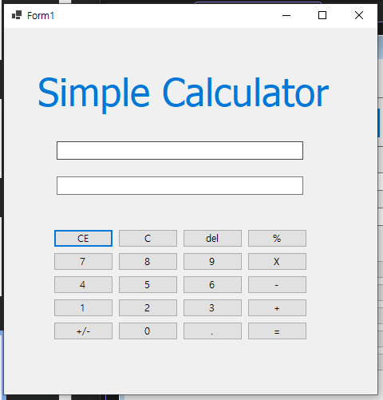
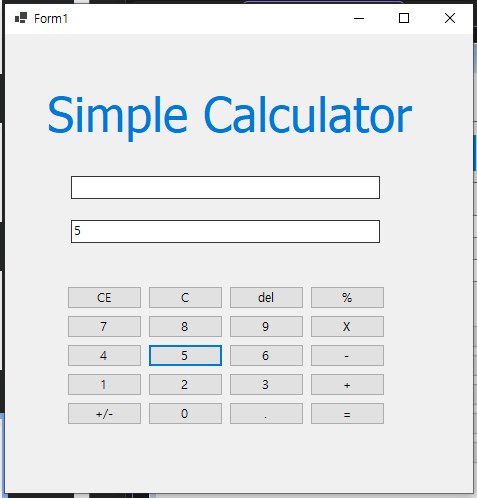
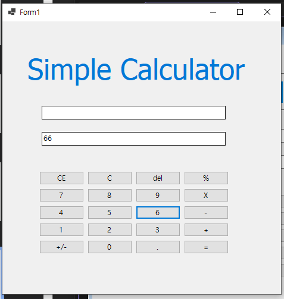
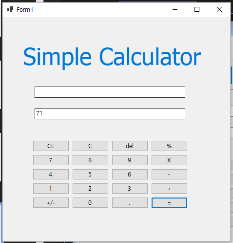
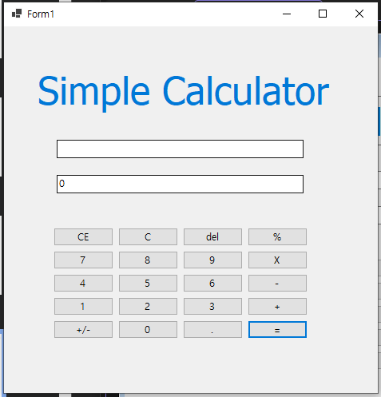
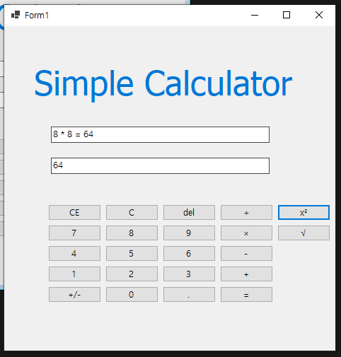
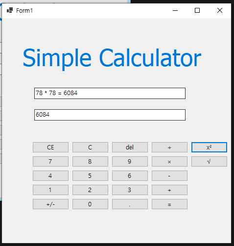
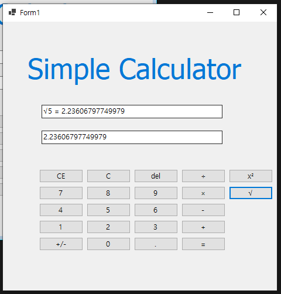
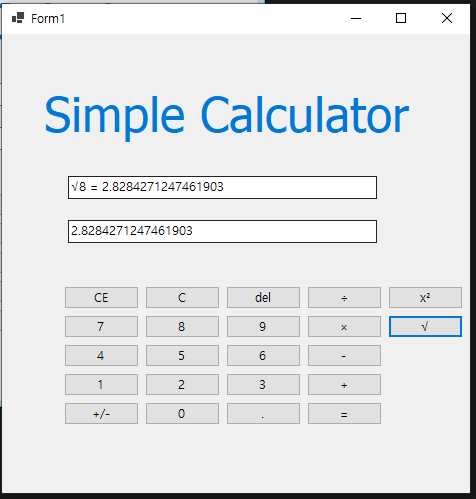
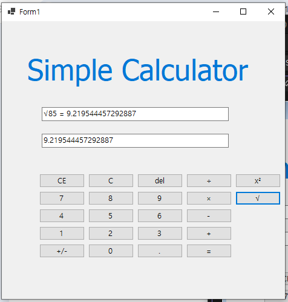

# (C# 코딩) 에코 메신저
## 개요

- C# 프로그래밍 학습

- 1줄 소개: 사용자 키보드 입력을 받아서 처리하는 프로그램

- 사용한 플랫폼:
C#, .NET Windows Forms, Visual Studio, GitHub

- 사용한 컨트롤:
Label, TextBox, ListBox, Button

- 사용한 기술과 구현한 기능:
Visual Studio를 이용하여 UI 디자인
string 클래스를 이용한 사용자 입력 데이터 처리
DateTime 클래스를 이용한 현재시간 정보 구하기

- 수업 중에 배우고 사용했던 클래스들 관련된 설명
-
-
- 실습 중에 구현한 기능들 설명
-
-

## 실행 화면 (과제1)
- 과제1 코드의 실행 스크린샷

UI 구성

숫자 5 입력

더하기 버튼 누른 후 숫자 66 입력

= 버튼을 누르면 덧셈 결과가 나옴

= 버튼을 두번 누르면 초기화됨

-과제 내용

TextBox(입력 및 결과 표시), Button(숫자 및 연산) 등을 적절히 배치합니다.

숫자 버튼 클릭 시 텍스트박스에 숫자가 표시되는 기능을 2가지 방식(교체/추가)으로 구현합니다.

구현 내용 및 기능 설명

UI 구성: TableLayoutPanel을 사용하여 계산기 버튼을 격자 형태로 정렬.

입력 기능: 첫 숫자 입력 시 "0"을 지우고 쓰고, 이후 숫자는 뒤에 이어 붙임.

더하기 연산: 입력된 문자열을 Int로 변환하여 덧셈을 수행하고 결과를 다시 문자열로 출력.

## 실행 화면 (과제2)
- 과제2 코드의 실행 스크린샷

3에서 2를 빼서 1이 나옴

9에 5를 곱해서 45가 나옴

9를 3으로 나눠서 3이 나옴

-과제 내용

뺄셈, 곱셈, 나눗셈 기능을 추가하여 사칙연산을 완성합니다.

-구현 내용 및 기능 설명

연산자 처리: switch-case문을 사용하여 operation 변수에 담긴 기호에 따라 연산 분기 처리.

나눗셈 예외 처리: 두 번째 피연산자가 0일 경우 "0으로 나눌 수 없습니다"라는 경고 메시지(MessageBox) 출력.

공통 이벤트: 연산자 버튼들을 하나의 이벤트 핸들러로 묶어 코드 효율성 증대.

## 실행 화면 (과제3)
- 과제3 코드의 실행 스크린샷

de 버튼을 사용하여 삭제 후 원래 입력되어있던 8까지 삭제하는 것이 아닌 잘못 입력한 5만 삭제함
5만 깔끔하게 삭제되어 8x6이 계산됨

c 버튼을 사용하여 현재의 모든 내용을 삭제하고 처음 (초기화된) 상태로 되돌아감

del 버튼을 사용하여 마지막 입력된 글자 하나 (숫자 하나) 값을 삭제함

-과제 내용
계산기 초기화(C), 현재 입력 지우기(CE), 한 글자 지우기(Del) 기능을 추가합니다.

-구현 내용 및 기능 설명

전체 초기화(C): 모든 변수(firstNum, operation)와 텍스트박스를 초기 상태로 리셋.

입력 초기화(CE): firstNum은 유지한 채 현재 입력 중인 txtDisplay 내용만 "0"으로 초기화.

백스페이스(Del): Substring 메서드를 사용하여 텍스트박스의 마지막 문자를 제거. 글자가 모두 지워지면 "0"으로 표시.

## 실행 화면 (과제4)
- 과제4 코드의 실행 스크린샷

제곱 기능 추가

제곱근 기능 추가

-과제 내용
기존 사칙연산 외에 수학적 특수 연산인 제곱 기능과 제곱근 기능을 추가함.
단항 연산자(숫자 하나를 입력받아 즉시 결과 출력)의 특성에 맞춰 UI와 로직을 설계함.

-구현 내용 및 기능 설명
제곱 연산: 현재 입력된 피연산자를 자기 자신과 곱하여 즉시 결과를 화면에 출력함.
제곱근 연산: Math.Sqrt 메서드를 사용하여 현재 숫자의 루트 값을 계산합니다. 음수 입력 시 MessageBox를 통해 예외 처리를 수행함.
연산 기록 동기화: 특수 연산 수행 시에도 상단 기록창(txtMessage)에 연산 과정(예: 5² = 25)이 실시간으로 업데이트되도록 구현함.
